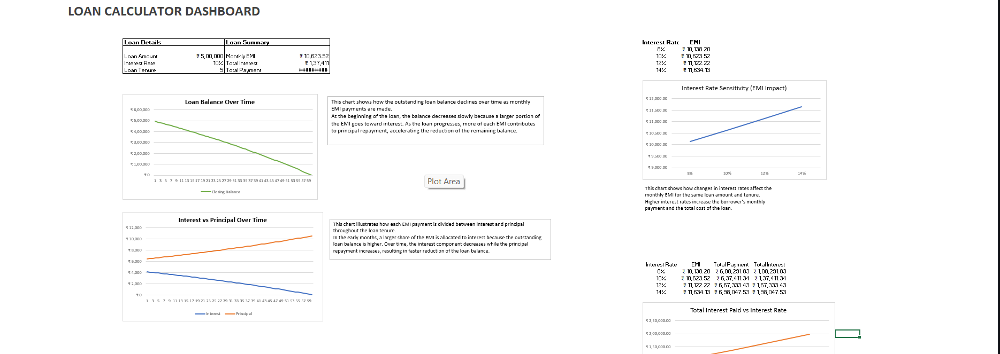
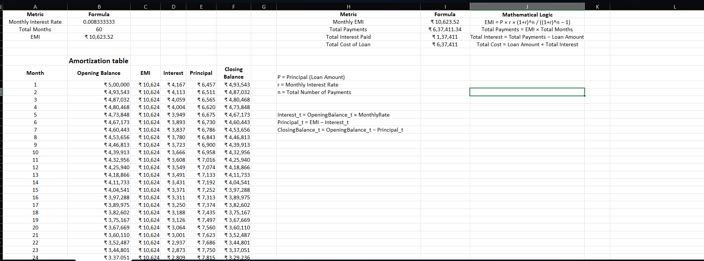
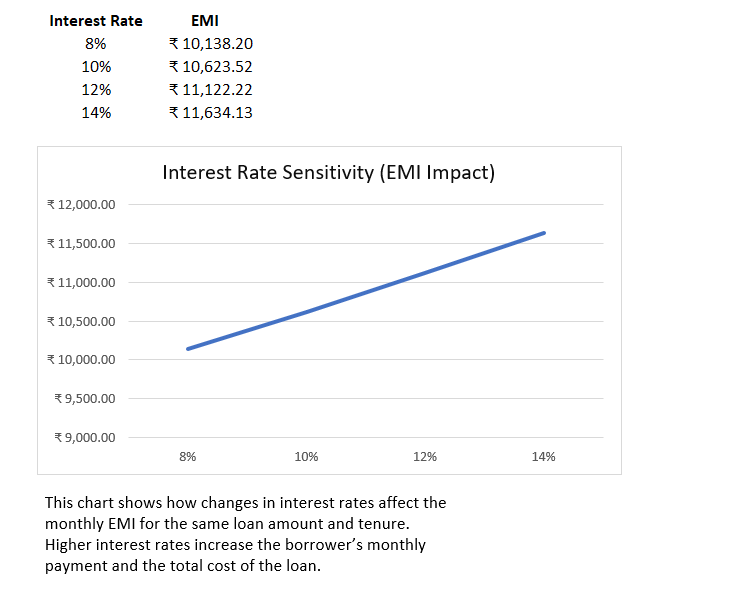
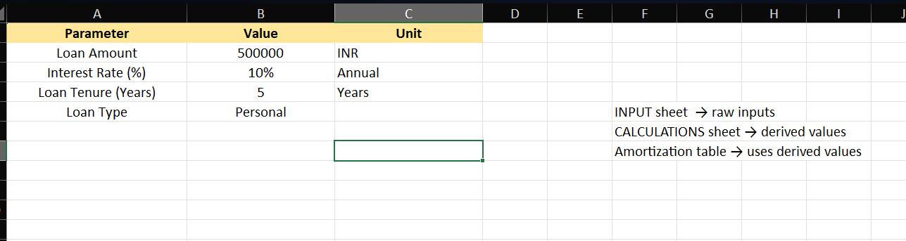

# Loan Amortization Financial Model (Excel)   1   2  3

## Project Overview

This project implements a **loan amortization financial model using Microsoft Excel**.
The model calculates the **Equated Monthly Installment (EMI)** for a loan and generates a complete **amortization schedule** showing how each payment is split between interest and principal over time.

The objective of this project is to demonstrate **financial modeling fundamentals**, structured Excel modeling, and an understanding of how loan repayment works in real financial systems.

This model is useful for analyzing:

- Monthly loan payment obligations
- Total interest paid over the loan period
- Principal repayment progression
- Overall cost of borrowing

---

## Features

The Excel model includes the following features:

- **EMI Calculation** using Excel financial functions
- **Loan Amortization Schedule** for the full repayment period
- **Interest vs Principal Breakdown**
- **Total Loan Cost Analysis**
- **Balance Decline Visualization**
- **Interest Rate Scenario Analysis**
- **Structured Financial Model Design**

---

## Financial Model Structure

The workbook is organized into three main components following standard financial modeling practices:

### 1. INPUT Sheet

Contains all user inputs required for the loan calculation.

Parameters include:

- Loan Amount
- Interest Rate (Annual)
- Loan Tenure (Years)
- Loan Type

These inputs drive the entire financial model.

---

### 2. CALCULATIONS Sheet

This sheet performs all derived financial calculations.

Key calculations include:

- Monthly Interest Rate
- Total Number of Payments
- Monthly EMI
- Total Payments Made
- Total Interest Paid
- Total Loan Cost

The sheet also generates the **complete amortization table** with the following columns:

| Month | Opening Balance | EMI | Interest | Principal | Closing Balance |
| ----- | --------------- | --- | -------- | --------- | --------------- |

---

### 3. DASHBOARD Sheet

The dashboard provides a visual summary of the loan model.

It includes:

- Key loan metrics
- Loan cost breakdown
- Balance decline visualization
- Interest vs principal repayment chart
- Interest rate scenario analysis

This allows users to quickly understand the financial impact of a loan.

## Dashboard Preview

### Loan Dashboard

### Amortization Schedule

### Interest Rate Sensitivity

---

## Key Financial Formulas

### EMI Formula

The Equated Monthly Installment (EMI) is calculated using the standard loan formula:

EMI = P × r × (1 + r)^n / ((1 + r)^n − 1)

Where:

- **P** = Loan Principal
- **r** = Monthly Interest Rate
- **n** = Total Number of Monthly Payments

Excel implementation:

=PMT(rate/12, years\*12, -principal)

---

### Interest Calculation

Interest for each month is calculated as:

Interest = Opening Balance × Monthly Interest Rate

---

### Principal Repayment

Principal component of each EMI:

Principal = EMI − Interest

---

### Remaining Loan Balance

Closing Balance after each payment:

Closing Balance = Opening Balance − Principal

The closing balance becomes the **opening balance of the next period**.

---

## Example Loan Scenario

| Parameter     | Value    |
| ------------- | -------- |
| Loan Amount   | ₹500,000 |
| Interest Rate | 10%      |
| Loan Tenure   | 5 Years  |

Results:

- Monthly EMI: ₹10,623.52
- Total Payments: ₹637,411
- Total Interest Paid: ₹137,411

---

## Screenshots

### Input Sheet

### Amortization Table

### Dashboard

---

## How to Use the Model

1. Open **Loan_Amortization_Model.xlsx**
2. Navigate to the **INPUT sheet**
3. Enter the desired:
   - Loan Amount
   - Interest Rate
   - Loan Tenure

4. The model automatically updates:
   - EMI calculation
   - Loan amortization schedule
   - Dashboard charts
   - Total loan cost analysis

---

## Learning Objectives

This project demonstrates:

- Financial modeling in Excel
- Loan amortization mathematics
- Structured spreadsheet design
- Financial formula implementation
- Data visualization for financial analysis

---

## Tools Used

- Microsoft Excel
- Excel Financial Functions (PMT)
- Excel Charts for Visualization

---

## Author

Abhay
Aspiring FinTech AI & Data Science Professional
